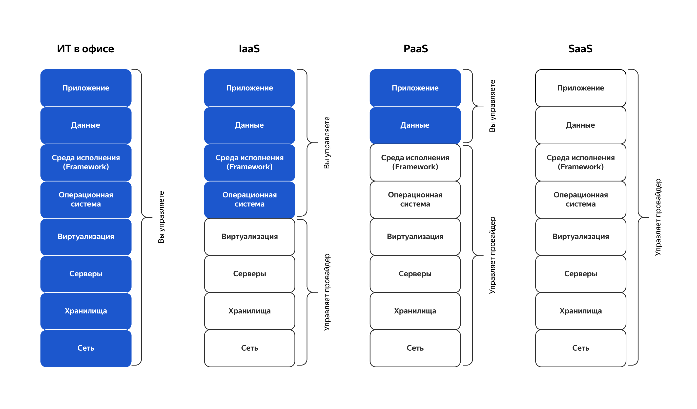
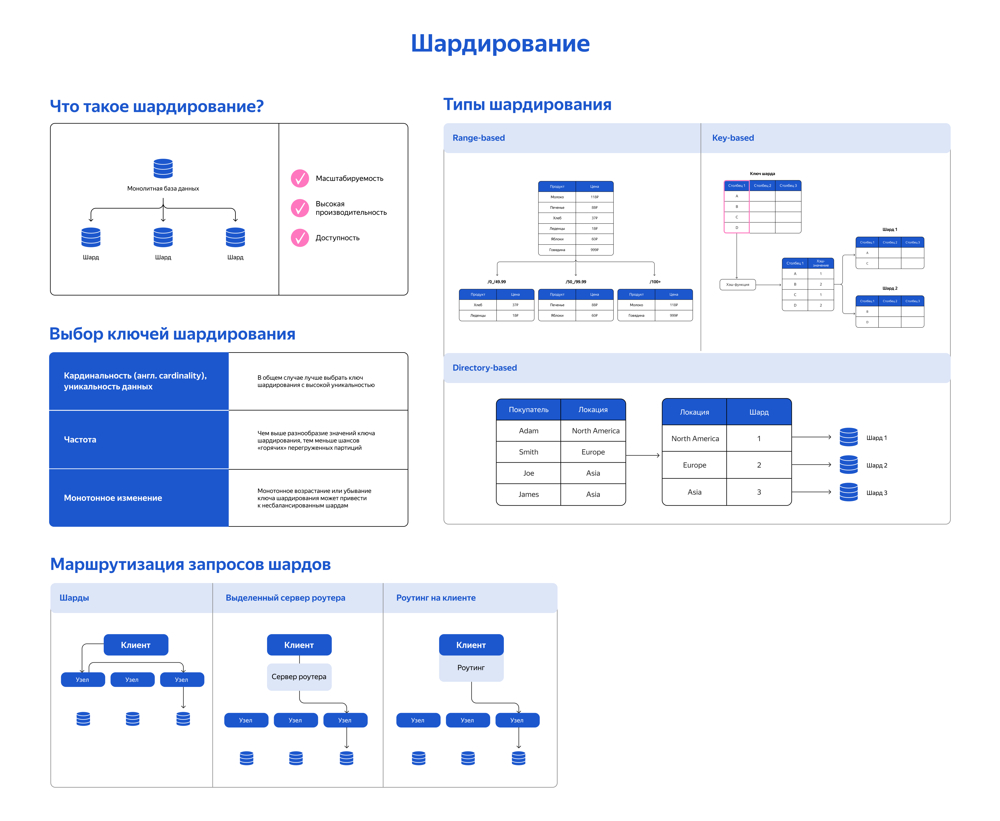

# 

[Введение в масштабирование](#scale)
[Репликация и кеширование](#replicate-caching)
[Шардирование](#sharding)
[Горизонтальное масштабирование приложения](#horizontal-scale)

## Введение в масштабирование 

**Вертикальное масштабирование**. Подразумевает добавление ресурсов к одному узлу, например, увеличение объёма оперативной памяти (RAM), мощности процессора (CPU), объёма жёсткого диска (HDD) на сервере. Вертикальное масштабирование эффективнее для улучшения производительности отдельных операций (например, по выборке данных из нескольких десятков таблиц).

**Горизонтальное масштабирование**. Заключается в добавлении новых узлов в систему, что позволяет распределить нагрузку между ними. Это обеспечивает практически неограниченный рост и лучшую отказоустойчивость, но требует более сложной настройки и управления. Горизонтальное масштабирование предпочтительнее для обработки больших объёмов данных и высоких нагрузок.

**Облачное, или гибридное масштабирование**. Использование облачных сервисов для масштабирования IT-решений. Это обеспечивает быстрое масштабирование в зависимости от потребностей, снижение затрат на инфраструктуру и обслуживание. По факту это комбинация вертикального и горизонтального масштабирования за счёт ресурсов облака.

### Примеры методов горизонтального масштабирования

**Репликация** - это процесс копирования и распространения данных между различными базами данных для обеспечения их согласованности и доступности.  
**Шардирование** - это метод разделения данных на отдельные фрагменты (шарды), который используется для повышения производительности и надёжности баз данных. Существует два основных вида шардирования: вертикальное и горизонтальное.  
**Кэширование** - данные временно сохраняются в памяти, чтобы сократить время доступа.  
**Географически распределенные ресурсы** - данные хранятся в географически распределенных центрах обработки данных, чтобы обеспечить минимальные задержки доступа для пользователей из разных регионов.  
**Автоматическое масштабирование** - позволяет динамически добавлять или удалять ресурсы в зависимости от текущей нагрузки.  
**Использование специализированных баз данных для разных типов данных** - в некоторых случаях целесообразно использовать различные базы данных для разных типов данных: например, реляционные базы данных для транзакционных данных и NoSQL для больших объёмов неструктурированных данных.

## Репликация и кэширование 

Существует два основных типа репликации: master-slave и multi-master.

### master-slave

Когда на главном узле происходит операция записи, он регистрирует изменения в журнале транзакций. Затем ведомые узлы извлекают эти журналы и применяют изменения к своим копиям данных. В зависимости от требований к согласованности, ведомые узлы могут:

- приостановить свою работу до получения обновлений от ведущего;
- продолжать обслуживать возможно устаревшие данные, одновременно применяя последние изменения в фоновом режиме.

**Паттерн read-replica**. В случае большой нагрузки на чтение мы намеренно читаем данные только с реплик, но запись всегда происходит только через мастера. Иногда данные в репликах могут отставать на несколько секунд или даже минут. Это может произойти из-за задержки в сети или перегрузки сервера. Решения:

- считывания с учётом задержки отправляются в основную базу данных;
- чтения, за которыми сразу следуют записи, направляются в основную базу данных;
- реляционная база данных обычно предоставляет способ проверить, совпадает ли реплика с первичной: если данные актуальны, она запросит реплику, а в противном случае завершит запрос на чтение ошибкой или прочитает данные с первичной базы.

### Репликация multi-master

Это тип репликации данных, при котором несколько узлов выполняют роль главных, то есть мастеров. Данные синхронизируются между узлами, а запись может происходить на любом из мастер-узлов. В результате создаётся несколько копий данных. Система решает проблему конфликтов между одновременными изменениями.

**Преимущества репликации**

- высокая доступность;
- высокая производительность системы;
- отказоустойчивость;
- гибкость в распределении нагрузки;

**Ограничения репликации**

- сложность с консистентностью данных;
- ресурсозатратность;
- сложность управления;

### MongoDB

Поддерживает репликацию:  
**Replicaset** - Механизм работы Replicaset подобен multi-master, но затраты на поддержание берёт на себя полностью СУБД. Replicaset обеспечивает высокую доступность и горизонтальное масштабирование. В реплике каждый узел может выполнять операции чтения и записи, что позволяет распределять нагрузку и поддерживать постоянную доступность данных.

Как работает репликация в MongoDB:

- **Запись и чтение с основного сервера.** Драйвер клиентского приложения выполняет операции чтения и записи на основном узле, в MongoDB его называют primary node. Затем информация, записанная на primary, асинхронно копируется на вторичный узел — secondary node, или слейв.
- **Чтение с реплики.** Драйвер может считывать данные с secondary-нод, что позволяет уменьшить нагрузку на основной сервер (тот самый подход read-replica).

Чтобы обеспечить согласованность и надёжность при репликации, MongoDB применяет двухфазный протокол фиксации.
Первичный сервер отправляет сообщение о предстоящей операции записи всем вторичным серверам. После подтверждения готовности от вторичных серверов первичный сервер выполняет операцию и рассылает сообщение о фиксации.
Если какой-либо из вторичных серверов не подтверждает сообщение о фиксации, первичный сервер откатывает операцию, чтобы сохранить целостность данных во всём наборе реплик.
Кроме того, MongoDB использует сообщения heartbeat для отслеживания состояния серверов, автоматического обнаружения сбоев и восстановления после них.

### Кеширование

Паттерн Cache Aside:

1. Приложение проверяет наличие нужных данных в кэше.
2. Если данных там нет, то запрос направляется в хранилище.
3. На обратном пути данные передаются в кэш, а запрос возвращается пользователю.

**Распределённый кэш** — это система, в которой данные хранятся на нескольких узлах кластера и в нескольких кластерах в разных центрах обработки данных по всему миру.

Система распределённого кэша объединяет оперативную память нескольких сетевых компьютеров в единое хранилище данных в оперативной памяти, которое используется в качестве кэша для быстрого доступа к данным.

Кластер состоит из трёх сегментов: это минимальное количество сегментов для осуществления кэширования в Redis. У каждого сегмента есть главный узел (master), который отвечает за все операции записи, а также узел-реплика (slave), который хранит копию данных. Сегмент кластера Redis может содержать до 500 реплик — так устроено в AWS и зависит от провайдера. Для определения общего состояния кластера используется протокол gossip.

### Репликация PostgreSQL

**Потоковая репликация**. Используется WAL (журнал предзаписи транзакций), который позволяет восстановить данные в случае сбоя. Потоковая может быть синхронной или асинхронной.

**Логическая репликация**. Отличается от потоковой тем, что она оперирует записями в таблицах PostgreSQL, а не физическим уровнем данных. Этот вид репликации основан на механизме публикации/подписки: один сервер публикует изменения, а другой подписывается на них.

# Шардирование 

Шардирование, партиционирование, или секционирование, — метод разделения больших объёмов данных на отдельные сегменты.

**Вертикальное партиционирование** — это метод разделения одной большой таблицы на несколько меньших, которые физически хранятся отдельно. При вертикальном партиционировании всё просто: достаточно придумать, что «отрезать» от таблицы, и перенести это в другую. Партиции могут содержать разные столбцы.

**Горизонтальное партиционирование** - Шардирование предполагает разделение данных на группы по определённым критериям. В зависимости от критерия, по которому распределяются данные, выделяют методы шардирования, но о них немного позже.
В результате разделения данных каждый сегмент (шард) включает одни и те же столбцы, но разные строки информации.

**Ограничения**

- сложность реализации;
- риск снижения эффективности разработки;
- неравномерность загрузки серверов;
- снижение скорости обработки сложных запросов.

### Методы шардирования

**Хэшированное шардирование**. Это разделение данных на шарды на основе хэш-функции. Хэш-функция принимает входные данные и возвращает хэш-значение, которое определяет, в какой шард попадёт каждая запись данных. Применение алгоритма к одному и тому же значению всегда даёт одинаковый результат.

Особенности алгоритма:

- высокая производительность;
- отсутствие единой точки отказа;
- равномерное распределение данных;
- затруднённый поиск данных.

**Диапазонное шардирование**. Разделение данных на шарды на основе диапазона значений (chunk). Каждому фрагменту присваивается диапазон на основе значений ключа сегментирования. Ключи сегментов, чьи значения близки друг к другу, чаще всего оказываются в одном диапазоне. Это упрощает выполнение целевых операций.

Особенности алгоритма:

- лёгкая реализуемость;
- быстрый поиск информации по сравнению с хэшированием;
- дисбаланс базы данных.

**Динамическое шардирование**. Автоматическое масштабирование хранилища в зависимости от текущей производительности и объёма данных. Такое шардирование очень гибкое, но требует сложной балансировки нагрузки, надёжного мониторинга и тщательно продуманной архитектуры базы данных. Динамическое шардирование обычно использует для определения местоположения записей внешний поисковый сервис.

**Геошардинг**. Это хранение в разных сегментах информации, относящейся к определённой географической зоне.

Существует три популярных способа реализовать шардирование:
**Средствами базы данных**. Некоторые базы данных, такие как MongoDB, Elasticsearch, ClickHouse и другие, могут автоматически распределять данные между своими экземплярами. Для этого достаточно настроить конфигурацию. Этот способ самый простой.  
**С использованием надстроек к базе данных**. Можно применять различные сторонние утилиты, которые выполняют шардирование, например для PostgreSQL (Citus). Однако здесь есть риск потери данных и снижения производительности.  
**С применением клиентских средств**. В этом случае экземпляры базы данных не знают о существовании друг друга, а шардированием управляет ваш сервис.

- Redis использует шардирование по умолчанию для распределения данных.

- В PostgreSQL шардирование можно реализовать с помощью стороннего инструмента Citus.
- В MongoDB можно реализовать диапазонное и хэшированное шардирование. Для запуска шардированного варианта MongoDB понадобится ещё два сервиса — роутер и сервис конфигурации. Вы рассмотрели практику с упрощённым шардированием — с меньшим количеством роутеров и серверов.

## Горизонтальное масштабирование приложения 

Способы сохранения состоянийй приложения:

**Stateful (с сохранением состояния)**. Подход, при котором система сохраняет информацию о предыдущих состояниях или взаимодействиях с клиентами. Применяется в ситуациях, когда экземпляров (инстансами) приложения несколько, но пользователю нужно всегда попадать на сервер, который владеет конкретным закреплённым за ним состоянием.

**Stateless (без сохранения состояния)**. Подход, при котором архитектура приложения не сохраняет информацию о предыдущих состояниях или сеансах где-то отдельно от остальных сервисов. Каждый запрос рассматривается как изолированное взаимодействие

### Балансировка нагрузки

**Сервис балансировки нагрузки** — это инструмент для распределения запросов между серверами внутри кластера.

- **Обеспечивает непрерывную работу приложения**. Если один из серверов выйдет из строя, балансировщик автоматически направит трафик на другой сервер, что позволит избежать простоя в работе приложения.
- **Позволяет провести горизонтальное масштабирование**. Балансировщик позволяет равномерно распределять нагрузку между
  несколькими экземплярами приложения. Добавление новых экземпляров приложения способствует увеличению общей производительности системы.
- **Повышает безопасность**. Некоторые балансировщики обладают функциями, которые помогают обеспечить безопасность системы. Они могут анализировать трафик, фильтровать запросы, а также направлять их через брандмауэры и другие защитные механизмы.

#### Виды балансировщиков нагрузки по устройству

- **Программные**. Это сервисы, которые обычно работают на отдельном сервере. В зависимости от выбранного алгоритма они отправляют трафик на тот или иной экземпляр приложения.
- **Виртуальные**. Это решение работает на виртуальной машине (VM) или как экземпляр программного обеспечения в виртуализированной среде. Например, в центрах обработки данных, где используются технологии виртуализации, такие как VMware, Hyper-V или KVM.
- **Аппаратные**. Это непосредственно физические устройства, работающие на 4 и 7 уровнях модели OSI. Они способны обрабатывать все виды трафика: HTTP, HTTPS, TCP и UDP. Такие балансировщики дороже, так как требуют отдельного физического устройства, его обслуживания и настройки.

#### Виды балансировщиков нагрузки по функциями

- **На 4, транспортном уровне**, балансировщик быстрее обрабатывает запросы, поскольку не анализирует содержимое пакетов и имеет возможность работать с адресами серверов.
- **На 7, уровне приложений**, балансировщик маршрутизирует контент с учётом содержимого и позволяет принимать сложные решения о маршрутизации, используя данные, специфические для конкретного приложения. Однако работает медленнее.

**Алгоритмы распределения нагрузки на уровне приложения:**

- **Round Robin** - в порядке очереди.
- **Weighted Round Robin** - в порядке очереди, но с весами, присваиваемые каждому экземпляру на основе его возможностей или характеристик производительности.
- **IP Hash (Sticky sessions)** - на тот же сервер, откуда пришел запрос, по хэшу IP-адреса пользователя.
- **Least Connection** - на наименее загруженный сервер.
- **Least Response Time** - на сервер с наименьшим средним временем обработки ответа.
- **Least Bandwidth** - на сервере с наименьшим трафиком.

#### API Gateway

Это единая точка входа для клиентских приложений. Он регламентирует коммуникации между клиентом и сервисами, убирая прямую привязку сервисов к клиентам, абстрагирует сервисы от клиентов.

Внутрь API Gateway, этой единой точки входа, можно добавить разную функциональность: аутентификацию, походы в кэш, роутинг, логирование и другие нужные функции и инструменты.

#### Service Discovery

Это паттерн, который облегчает коммуникацию между приложениями, даже если меняется количество их инстансов или сетевое расположение.

Основой этого принципа служит Service Registry — реестр, что-то вроде маленькой базы данных, в котором хранится метаинформация о микросервисах, их экземплярах и сетевом расположении.

#### APISIX Gateway

**APISIX Gateway, или API-шлюз**, — это популярный инструмент с открытым исходным кодом и встроенным Consul. **Consul** — продукт от компании HashiCorp, который позволяет регистрировать и отменять регистрацию IT-сервисов, работающих в сети организации, а также хранить информацию о них. Кроме того, Consul представляет собой хранилище данных типа «ключ — значение».  
Consul особенно полезен организациям, применяющим микросервисную архитектуру в своей инфраструктуре.

Сайт посылает запросы к API-шлюзу, который выступает в роли балансировщика и агрегатора. API отправляет запросы к конкретным инстансам, а сам список инстансов API-шлюз получает от хранилища Consul через модуль-адаптер сounsul_kv. Модуль-адаптер позволяет разделить сервис и клиентское приложение и реализовать две основные функции реестра обнаружения сервисов.

### Шарды и реплики в геораспределенной среде

**Гибридная архитектура** - часть данных лежит в публичном облаке, а часть внктри компании, либо тоже во внутреннем облаке, либо просто на "железе". Внутри компании в основном оставляют персонаотные данные (в соответствии с 152-ФЗ).

В облаке ресурсы поставляют в частично готовом виде: по моделям IaaS, PaaS или SaaS.

### Распределенное кеширование

Кеширование в облаке.

**Преимущества:**

- Высокая доступность данных, или high availability (если один узел выйдет из строя, другие подхватят);
- Высокая скорость работы и производительность приложений (распределение серверов по географии);
- Проще масштабирование;
- Ниже затраты.

**Ограничения распределенного облачного кеширования:**

- Зависимость от сети;
- Сложность настройки и управления;
- Меньшая безопасность данных;
- Риск потери данных;
- Необходимость обучения персонала;
- Влияние на производительность;
- Сложности интеграции.

**Выбор хранилища для кеширования:**  
Существует четыре типа хранилищ:

- **HDD**. Обладают большим объёмом, но низкой скоростью обмена данными. Стоимость — низкая.
- **SSD**. Обладают меньшим объёмом, но высокой скоростью обмена данными. Стоимость — выше, чем у HDD, но не слишком высокая.
- **RAM**. Оптимальное соотношение цены и объёма обработки данных.
- **CPU Cashe и CPU Registers**. Самые дорогие и быстрые. Объём низкий.

### Content Delivery Network

Механизм работы основан на разделении данных по системе доменных имен (DNS). Есть 2 метода разделения данных:

#### GeoDNS

**GeoDNS** — это метод географических доменных имён, который использует алгоритм определения геокоординат по IP-адресу пользователя. Клиент отправляет запрос, DNS-сервер определяет местоположение пользователя по IP-адресу и находит ближайшую точку присутствия.
**Точка присутствия (пограничный узел, Point of presence, PoP)** - базовый компонент CDN, в котором находятся копии или кэшированная версия контента, полученного от основного источника.

**GeoDNS позволяет:**

- Оптимизировать трафик и обеспечить надёжную балансировку нагрузки;
- Блокировать посетителей веб-сайта по странам;
- Выдавать контент адресно в зависимости от геоположения посетителя.

#### Anycast

**Anycast** — это метод сетевой адресации и маршрутизации, при котором один IP-адрес присваивается нескольким серверам в сети. Серверы при этом находятся в разных точках присутствия.

В зависимости от местоположения источника запросов данные отправляются на ближайший сервер. Так можно уменьшить количество сетевых переходов и задержку в передаче данных. Запрос DNS-клиента будет отправляться от одной точки присутствия к другой, пока не достигнет первого авторитетного сервера имён.  
Авторитетный сервер для зоны — это DNS-сервер, который хранит IP-адреса для зоны, например, RU, COM, и информацию о доменах зоны в текстовом файле, известном как основной файл зоны.
