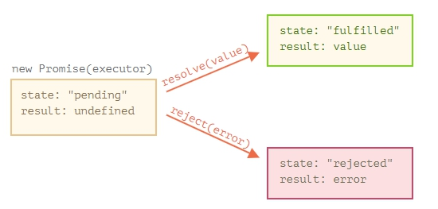

# JavaScript <a name='home'></a> 
 + [Врмененна мертвая зона](#death-zone)
 + [Boxing/Unboxing](#boxing)
 + [Стрелочные функции](#arrow)
 + [Объекты](#object)
    + [Разница между in и hasOwnProperty](#in-has)
 + [JSON](#json)   
 + [Модули](#moduls)
 + [Наблюдатели](#observers)
 + [Промисы](#promises)
    + [Экспорт](#export)
    + [Импорт](#import)
+ [Web Workers](#web-workers)
+ [Worklet](#worklet)
+ [Service Workers](#service-workers)
+ [PWA](#pwa)
  * [Manifest](#manifest) 
# Браузер
+ [Критический путь рендеринга](#crp)  
+ [Оптимизация критического пути рендеринга](#optimize-crp)  


[^ Вверх](#home)
# Временная мертвая зона <a name='death-zone'></a>
Это зона от начала блока, в котором была объявлена переменная до момента её объявления через **let**. Если к переменной обратиться до момента её объявления, то возникает исключение **Reference Error**. 

[^ Вверх](#home)
# Boxing/Unboxing <a name='boxing'></a>
В JS строки, логические значения, null и числа реализованы как примитивные значения и методов не имеют. JS автоматически упаковывает примитивные типы в соответствующие объекты, когда встречает вызовы методов на них и затем автоматически распаковывает. Т.е. в действительности все методы, которые вызываются на строках, хранятся в прототипе конструктора String.
```javscript
'hello'.toUpperCase();
```

[^ Вверх](#home)
# Стрелочные функции <a name='arrow'></a>
- Не имеют собственного **this**, если в функции идет обращение, то **this** берется из внешнего контекста;   
- Не имеют массива **arguments**.

[^ Вверх](#home)
# Объекты <a name='object'></a>

## Разница между in и hasOwnProperty <a name='in-has'></a>
Цикл ```for..in``` не только по собственным свойствам объекта, но и по унаследованным.  
```hasOwnProperty``` возвращает **true**, если это собственное свойство, а не унаследованное, т.е. с помощью него в цикле можно отфильтровать собственные свойства.


[^ Вверх](#home)
# JSON <a name='json'></a>
```JSON.stringify``` пропускает некоторые специфические свойства объектов:  
  - методы;  
  - символьные свойства;  
  - свойства равные **undefined**.  
В преобразуемом объекте не должно быть циклических ссылок.   

[^ Вверх](#home)
# Модули <a name='moduls'></a>
* ```export``` отмечает переменные и функции, которые должны быть доступны вне текущего модуля.   
* ```import``` позволяет импортировать функциональность из других модулей.

Так как модули поддерживают ряд специальных ключевых слов, и у них есть ряд особенностей, то необходимо явно сказать браузеру, что скрипт является модулем, при помощи атрибута ```<script type="module">```.

```javascript
<!doctype html>
<script type="module">
  import {sayHi} from './say.js';

  document.body.innerHTML = sayHi('John');
</script>
```
**Особенности модулей:**  
1. В модулях всегда используется режим ```use strict```;  
2. Каждый модуль имеет свою собственную область видимости. Переменные и функции, объявленные в модуле, не видны в других скриптах. 

Если необходимо сделать глобальную переменную уровня всей страницы, можно явно присвоить её объекту ```window```, так же получать через объект ```window```.

3. Если один и тот же модуль используется в нескольких местах, то его код выполнится только один раз, после чего экспортируемая функциональность передаётся всем импортёрам.

Т.е. если можуль импортирован в несколько, например, других модулей, и в одном из них внести правки в данные этого модуля, то эти изменения будут видны и в других модулях.

4. В модуле на верхнем уровне this не определён (undefined).

**Особенности в браузерах:**  
1. Модули всегда выполняются в отложенном (**deferred**) режиме, точно так же, как скрипты с атрибутом **defer**.

Загрузка внешних модулей, таких как ```<script type="module" src="...">```, не блокирует обработку HTML. Модули, даже если загрузились быстро, ожидают полной загрузки HTML документа, и только затем выполняются. Т.е. сохраняется порядок загрузки скриптов.

Т.е. **модули всегда видят полностью загруженную HTML-страницу, включая элементы под ними**.

2. При использовании ```async``` модуль не дожидается загрузки документа.

**Особенности внешних скриптов с атрибутом ```type="module"```:**

1. Внешние скрипты с одинаковым атрибутом src запускаются только один раз.  
2. Внешний скрипт, который загружается с другого домена, требует указания заголовков CORS (Access-Control-Allow-Origin).

> Старые браузеры не понимают атрибут ```type="module"``. Скрипты с неизвестным атрибутом ```type`` просто игнорируются. Можно сделать для них «резервный» скрипт при помощи атрибута ```nomodule```.

```javascript
<script type="module">
  alert("Работает в современных браузерах");
</script>

<script nomodule>
  alert("Современные браузеры понимают оба атрибута - и type=module, и nomodule, поэтому пропускают этот тег script")
  alert("Старые браузеры игнорируют скрипты с неизвестным атрибутом type=module, но выполняют этот.");
</script>
```
## Экспорт <a name='export'></a>
```javascript
function sayHi(user) {
  alert(`Hello, ${user}!`);
}

function sayBye(user) {
  alert(`Bye, ${user}!`);
}

export {sayHi, sayBye}; // список экспортируемых переменных
```
Если необходимо экспортировать элементы под другим именем используется синтаксис вида:
```javascript
export {sayHi as hi, sayBye as bye};
```
**Экспорт по умолчанию**  
Именованный экспорт	
```javascript
export class User {...}  	
import {User} from ...
```
Экспорт по умолчанию
```javascript
export default class User {...}
import User from ...
```
Так как в файле может быть максимум один export default, то экспортируемая сущность не обязана иметь имя.

В некоторых ситуациях для обозначения экспорта по умолчанию в качестве имени используется **default**.

```javascript
// то же самое, как если бы мы добавили "export default" перед функцией
export {sayHi as default};
```
Вот как импортировать экспорт по умолчанию вместе с именованным экспортом:
```javascript
import {default as User, sayHi} from './user.js';

new User('John');
```
Есть одна существенная разница при именованном импорте и импорте по умолчанию. При именованном импорте модуль подключается и выполняет только один раз, первый, но если модлуь импортировать по умолчанию несколько раз под разными именами, то это сработает.

### Реэкспорт
Синтаксис «реэкспорта» ```export ... from ...``` позволяет импортировать что-то и тут же экспортировать, возможно под другим именем:
```javascript
export {sayHi} from './say.js'; // реэкспортировать sayHi
export {default as User} from './user.js'; // реэкспортировать default
```

## Импорт <a name='import'></a>
```javascript
import {импортированные элементы} from 'строковый полный путь';
```
Если необходимо импортировать все элементы из модуля, то можно использовать запись вида ```import * as <obj>```.

```javascript
import * as say from './say.js';
```
Также можно использовать ```as```, чтобы импортировать под другими именами.
```javascript
import {sayHi as hi, sayBye as bye} from './say.js';
```

### Динамический импорт
Выражение ```import(module)``` загружает модуль и возвращает промис, результатом которого становится объект модуля, содержащий все его экспорты. Использовать его можно в любом месте кода.
```javascript
import(modulePath)
  .then(obj => <объект модуля>)
  .catch(err => <ошибка загрузки, например если нет такого модуля>)
```

Или если внутри асинхронной функции, то можно ```let module = await import(modulePath)```.

для доступа к модулю, импортированному по умолчанию, следует взять свойство **default** объекта модуля:
```javascript
let obj = await import('./say.js');
let say = obj.default;
// или, одной строкой: let {default: say} = await import('./say.js');

```

[^ Вверх](#home)
# Наблюдатели <a name='observers'></a>


[^ Вверх](#home)
# Промисы <a name='promises'></a>

```javascript
let promise = new Promise(function(resolve, reject) {
  // функция-исполнитель (executor)
  // "певец"
});
```

* ```resolve(value)``` — если работа завершилась успешно, с результатом value.  
* ```reject(error)``` — если произошла ошибка, error – объект ошибки.

Исполнитель запускается автоматически, он должен выполнить работу, а затем вызвать ```resolve``` или ```reject```.

У объекта promise, возвращаемого конструктором ```new Promise```, есть внутренние свойства:

* ```state («состояние»)``` — вначале **"pending"** («ожидание»), потом меняется на **"fulfilled"** («выполнено успешно») при вызове resolve или на **"rejected"** («выполнено с ошибкой») при вызове reject.  
* ```result («результат»)``` — вначале **undefined**, далее изменяется на **value** при вызове resolve(value) или на **error** при вызове reject(error).

Свойства ```state``` и ```result``` – это внутренние свойства объекта Promise и прямого доступа к ним нет. Для обработки результата следует использовать методы ```.then```/```.catch```/```.finally```.

<div style="text-align:center">
  
</div>

Исполнитель должен вызвать что-то одно: ```resolve``` или ```reject```. Состояние промиса может быть изменено только один раз. Если в исполнителе указаны несколько вызовов ```resolve/reject```, то выполнится только первый вызов одной из функций, остальные будут проигнорированы. 

Функция ```resolve/reject``` ожидает только один аргумент (или ни одного). Все дополнительные аргументы будут проигнорированы. Функцию ```reject``` можно выполнить с любым типом аргумента, но лучше всего вызывать с аргументом ```Error```.

Если промис в состоянии ожидания, обработчики в ```.then/catch/finally``` будут ждать его. Однако, если промис уже завершён, то обработчики выполнятся сразу.

## then
```javascript
promise.then(
  function(result) { /* обработает успешное выполнение */ },
  function(error) { /* обработает ошибку */ }
);
```
Функция ```then``` каждый раз возвращает новый объект промиса. Но при этом обработчик может возвращать не именно промис, а любой объект, содержащий метод ```.then```, такие объекты называют **«thenable»**, и этот объект будет обработан как промис.

```javascript
promise.then(
  function(result) { return 4; }  // эквивалентно Promise.resolve(4), state = fulfilled, поэтому следующий then выполнится 
);
```

```javascript
promise.then(
  function(result) { return new Promise(res, rej); }  // state = pending, поэтому следующий then не выполнится, пока не выполниться данный промис 
);
```
Если в ```.then``` прокинуть ```throw```, то следующей выполниться функция ```.catch```.


## catch
Вызов ```.catch(f)``` – это сокращённый, «укороченный» вариант ```.then(null, f)```.
```javascript
let promise = new Promise((resolve, reject) => {
  setTimeout(() => reject(new Error("Ошибка!")), 1000);
});

// .catch(f) это тоже самое, что promise.then(null, f)
promise.catch(alert); // выведет "Error: Ошибка!" спустя одну секунду
```
Вокруг функции промиса и обработчиков находится "невидимый try..catch". Если происходит исключение, то оно перехватывается, и промис считается отклонённым с этой ошибкой.

Это работает не только в функции промиса, но и в обработчиках. Если бросить ошибку (throw) из обработчика (.then), то промис будет считаться отклонённым, и управление перейдёт к ближайшему обработчику ошибок.

```javascript
new Promise((resolve, reject) => {
  throw new Error("Ошибка!");
}).catch(alert); // Error: Ошибка!
```
Это происходит для всех ошибок, не только для тех, которые вызваны оператором ```throw```.

Если мы пробросим (throw) ошибку внутри блока ```.catch```, то управление перейдёт к следующему ближайшему обработчику ошибок. А если мы обработаем ошибку и завершим работу обработчика нормально, то продолжит работу ближайший успешный обработчик ```.then```.

Если ошибка не обработана с помощью ```.catch()```, то JavaScript-движок отслеживает такие ситуации и генерирует в этом случае глобальную ошибку. В браузере можно поймать такие ошибки, используя событие ```unhandledrejection```.

```javascript
window.addEventListener('unhandledrejection', function(event) {
  // объект события имеет два специальных свойства:
  alert(event.promise); // [object Promise] - промис, который сгенерировал ошибку
  alert(event.reason); // Error: Ошибка! - объект ошибки, которая не была обработана
});

new Promise(function() {
  throw new Error("Ошибка!");
}); 
```


## finally
Вызов ```.finally(f)``` похож на ```.then(f, f)```, f выполнится в любом случае, когда промис завершится: успешно или с ошибкой.

```javascript
new Promise((resolve, reject) => {
  /* сделать что-то, что займёт время, и после вызвать resolve/reject */
})
  // выполнится, когда промис завершится, независимо от того, успешно или нет
  .finally(() => остановить индикатор загрузки)
  .then(result => показать результат, err => показать ошибку)
```

* Обработчик, вызываемый из **finally**, не имеет аргументов. В **finally** неизвестно, как был завершён промис.  
* Обработчик **finally** «пропускает» результат или ошибку дальше, к последующим обработчикам.

**finally** не предназначен для обработки результата.

## Цепочка промисов

```javascript
new Promise(function(resolve, reject) {

  setTimeout(() => resolve(1), 1000); // (*)

}).then(function(result) { // (**)

  alert(result); // 1
  return result * 2;

}).then(function(result) { // (***)

  alert(result); // 2
  return result * 2;

}).then(function(result) {

  alert(result); // 4
  return result * 2;

});
```

Обработчик ```handler```, переданный в ```.then(handler)```, может вернуть промис. В этом случае дальнейшие обработчики ожидают, пока он выполнится, и затем получают его результат.

## Замена callback на промисы
Промис может иметь только один результат, но колбэк технически может вызываться сколько угодно раз.

```javascript
function loadScript(src, callback) {
  let script = document.createElement('script');
  script.src = src;

  script.onload = () => callback(null, script);
  script.onerror = () => callback(new Error(`Ошибка загрузки скрипта ${src}`));

  document.head.append(script);
}

// использование:
// loadScript('path/script.js', (err, script) => {...})
```
```javascript
let loadScriptPromise = function(src) {
  return new Promise((resolve, reject) => {
    loadScript(src, (err, script) => {
      if (err) reject(err)
      else resolve(script);
    });
  })
}

// использование:
// loadScriptPromise('path/script.js').then(...)
```


## Promise API
## Promise.all
Используется для запуска множества параллельных промисов. 

Метод ```Promise.all``` принимает массив промисов (может принимать любой перебираемый объект, но обычно используется массив) и возвращает новый промис.

Новый промис завершится, когда завершится весь переданный список промисов, и его результатом будет массив их результатов. 

```javascript
Promise.all([
  new Promise(resolve => setTimeout(() => resolve(1), 3000)), // 1
  new Promise(resolve => setTimeout(() => resolve(2), 2000)), // 2
  new Promise(resolve => setTimeout(() => resolve(3), 1000))  // 3
]).then(alert); // когда все промисы выполнятся, результат будет [1,2,3]
// каждый промис даёт элемент массива
```
Gорядок элементов массива ответа в точности соответствует порядку исходных промисов. Даже если первый промис будет выполняться дольше всех, его результат всё равно будет первым в массиве.

**Если любой из промисов завершится с ошибкой, то промис, возвращённый Promise.all, немедленно завершается с этой ошибкой.**


Обычно, Promise.all(...) принимает перебираемый объект промисов (чаще всего массив). Но если любой из этих объектов не является промисом, он передаётся в итоговый массив «как есть».

## Promise.allSettled
Аналогичен Promise.all, но при этом всегда ждёт завершения всех промисов. В массиве результатов будет:

* ```{status:"fulfilled", value:результат}``` для успешных завершений,  
* ```{status:"rejected", reason:ошибка}``` для ошибок.

```javascript
let urls = [
  'https://api.github.com/users/iliakan',
  'https://api.github.com/users/remy',
  'https://no-such-url'
];

Promise.allSettled(urls.map(url => fetch(url)))
  .then(results => { // (*)
    results.forEach((result, num) => {
      if (result.status == "fulfilled") {
        alert(`${urls[num]}: ${result.value.status}`);
      }
      if (result.status == "rejected") {
        alert(`${urls[num]}: ${result.reason}`);
      }
    });
  });

 // Ответ:
 //[
 // {status: 'fulfilled', value: ...объект ответа...},
 // {status: 'fulfilled', value: ...объект ответа...},
 // {status: 'rejected', reason: ...объект ошибки...}
 //] 
```

Полифилл:
```javascript
if(!Promise.allSettled) {
  Promise.allSettled = function(promises) {
    return Promise.all(promises.map(p => Promise.resolve(p).then(value => ({
      state: 'fulfilled',
      value: value
    }), error => ({
      state: 'rejected',
      reason: error
    }))));
  };
}
```

## Promise.race
Метод похож на **Promise.all**, но ждёт только первый промис, из которого берёт результат (или ошибку), остальные промисы игнорируются.

```javascript
Promise.race([
  new Promise((resolve, reject) => setTimeout(() => resolve(1), 1000)),
  new Promise((resolve, reject) => setTimeout(() => reject(new Error("Ошибка!")), 2000)),
  new Promise((resolve, reject) => setTimeout(() => resolve(3), 3000))
]).then(alert); // 1
```

## Promise.resolve/reject

* ```Promise.resolve(value)``` создаёт успешно выполненный промис с результатом value. Аналогичен:
```javascript
let promise = new Promise(resolve => resolve(value));
```

* ```Promise.reject(error)``` создаёт промис, завершённый с ошибкой error. Аналогичен:
```javascript
let promise = new Promise((resolve, reject) => reject(error));
```

[^ Вверх](#home)
# Web Workers <a name='web-workers'></a>
Позволяет выполнять скрипт в фоновом потоке, отделенном от основного. При этом воркеры используют много памяти, тяжелый и медленный процесс.  
**this = self**

[**Worklet**](#worklet) - облегченная версия веб-воркера для тяжелых вычислений.


[^ Вверх](#home)
# Worklet <a name='worklet'></a>
**Worklet** - облегченная версия веб-воркера и предоставляет разработчикам доступ к частям низкоуровневого конвейера визуализации.  
Используется, когда требуется высокая производительность, например, для обработки звука или графики. Ему всё равно в каком потоке работать, может в основном, может в параллельном, может иметь несколько областей видимости.  

###Типы ворклетов:
+ [PaintWorklet](#paint-worklet) - для программного создания изображений;  
+ [AudioWorklet](#audio-worklet) - для обработки звука;  
+ [AnimationWorklet](#animation-worklet) - для создания анимаций с прокруткой или высоконагруженных анимаций;  
+ [LayoutWorklet](#layout-worklet) - для определения расположения и размеров пользовательских эелементов;  

```worklet.addModule(moduleURL, [options])``` - добавляет модуль к текущему воклету, возвращает промис, в случае ошибки возвращает AbortError(скрипт с проблемой и не может быть загружен) или SintaxError(неверный url).  
```javascript
options {  
  credentials: 'omit' | "same-origin" | "include"   //указывает отправлять ли учетные данные, куки, аутентификацию HTTP
}
```


[^ Вверх](#home)
# Service Workers <a name='service-workers'></a>


[^ Вверх](#home)
# PWA <a name='pwa'></a>

## Manifest <a name='manifest'></a>
```javascript
{
    "name": "",           // Полное название приложения
    "short_name": "",     // Короткое название для отображения на домашнем экране
    "description": "",    // Одно-два предложения, описывающих приложение
    "icons": [            // Значки для использования после установки приложения, 
        {                 // необходимы разные значки для экранов разных расширений
            "src": "icons/icon-32.png",
            "sizes": "32x32",
            "type": "image/png"
        },
        // ...
        {
            "src": "icons/icon-512.png",
            "sizes": "512x512",
            "type": "image/png"
        }
    ],
    "start_url": "ю/index.html",  // Загружаемый исходный документ при запуске приложения
    "display": "fullscreen",      // Как приложение должно отображаться; может быть fullscreen (полноэкранный), 
                                  // standalone (автономный), minimal-ui (минимальный пользовательский интерфейс), browser (браузер)
    "theme_color": "#B12A34",     // Основной цвет для интерфейса, используемый операционной системой
    "background_color": "#B12A34" // Цвет для фона, используемый при установке и на заставке
    ...          // есть еще дополнительные элементы манифеста
}
```

[^ Вверх](#home)
# Критический путь рендеринга <a name='crp'></a>
  + **Запрос на сервер HTML-страницы**  
  Сервер возвращает html и некоторые данные в заголовке ответа. Запрос осуществляется методом GET.  
  + **Построение DOM-дерева**  
  Браузер парсит html и превращает его в DOM-дерево.  
  Браузер создает новый запрос каждый раз, когда он находит ссылки на внешние ресурсы, будь то файлы стилей, скриптов или ссылки на изображения. Некоторые запросы являются блокирующими. Это означает, что пока такие запросы выполняются - другие запросы приостанавливается. Браузер продолжает парсить HTML и создавать DOM до тех пор, пока запрос на получение HTML не подходит к концу.   JavaScript можно загружать асинхронно, указав атрибут async, для того, чтобы избежать блокировки парсера.    
  Построение DOM инкрементально. Ответ в виде HTML превращается в токены, которые превращаются в узлы (nodes), которые формируют DOM дерево. Простейший узел начинается с startTag-токена и заканчивается токеном endTag. Узлы содержат всю необходимую информацию об HTML элементе, соответствующем этому узлу. Узлы (nodes) связаны с Render Tree с помощью иерархии токенов: если какой-то набор startTag и endTag-токенов появляется между уже существующим набором токенов, мы получаем узел (node) внутри узла (node), то есть получаем иерархию дерева DOM.
  + **Построение CSSOM-дерева**  
  CSSOM - это объект, представляющий стили, связанные с DOM. Он выглядит так же как DOM, но с соответствующими стилями для каждого узла. Не имеет значения были ли стили объявлены явно или наследуются.   
  CSS также может являться «блокирующим скрипты», потому что JavaScript-файлы должны дождаться построения CSSOM, прежде чем начать исполняться.
  + **Запуск JavaScript**   
  JavaScript является блокирующим ресурсом для парсера. Это означает, что JavaScript блокирует разбор самого HTML-документа.  
  Когда парсер доходит до тега \<script\> (не важно внутренний он или внешний), он останавливается, забирает файл (если он внешний) и запускает его. Вот почему, если мы имеем JavaScript-файл, который ссылается на элементы документа, мы обязательно должны поместить его после их появления.  
  JavaScript можно загружать асинхронно, указав атрибут async, для того, чтобы избежать блокировки парсера.
  + **Создание Render-дерева**  
  Render-дерево — это совокупность DOM и CSSOM. Это дерево, которое даёт представление о том, что в конечном итоге будет отображено на странице. Это означает, что оно захватывает только видимый контент и не включает, например, элементы, которые были скрыты с помощью CSS-правила display: none.
  + **Компоновка (Layout)**   
  Компоновка — это то, что определяет размер видимой области документа (viewport), которая обеспечивает контекст для стилей CSS, зависимых от него, например, проценты или единицы вьюпорта.   
  Размер вьюпорта определяется метатэгом, находящемся в <head> документа или, если тэг не представлен, будет использовано стандартное значение вьюпорта шириною в 980 пикселей.     Например, наиболее частым значением для этого метатэга является размер, соответствующий с шириной устройства.
  ```css
  <meta name="viewport" content="width=device-width,initial-scale=1">
  ```
  + **Отрисовка (Paint)**  
  Видимый контент страницы преобразуется в пиксели, чтобы появиться на экране.

[^ Вверх](#home)
# Оптимизация критического пути рендеринга <a name='optimize-crp'></a>
1. **Минификация скриптов и кеширование:**Сжатие сокращает время загрузки страницы, а кэширование позволяет экономить трафик. Вместо загрузки по сети, критически важные ресурсы сохраняются в локальной копии.
2. **Разбиение css-файлов, использование атрибута media в теге link**: Атрибут media указывает устройство, для которого следует применять стилевое оформление либо является медиа-запросом, но он делает подключение стилей неблокирующими. Поэтому есть смысл разделить стили на обязательные и с низким приоритетом, например, вынести стили медиа-запросы или для печати в отдельные файлы.
3. **Async для JS:** Скрипты с тегом async загружаются в фоновом режиме и не являются блокирующими.