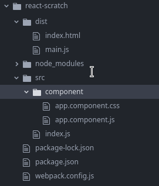

 # Webpack

1. [Webpack и Babel для настройки React приложения](#webpack-babel-react)

**Webpack** берёт всё, от чего зависит проект, и преобразует это в статические ресурсы, которые могут быть переданы клиенту. Упаковка приложений — это очень важно, так как большинство браузеров ограничивает возможности по одновременной загрузке ресурсов. Кроме того, это позволяет экономить трафик, отправляя клиенту лишь то, что ему нужно. В частности, **Webpack** использует внутренний кэш, благодаря чему модули загружаются на клиент лишь один раз, что, в итоге, приводит к ускорению загрузки сайтов.

 ## Webpack и Babel для настройки React-приложения <a name="webpack-babel-react"></a>
 Для того чтобы настроить проект React-приложения, необходимы следующие npm-модули:
 
* **react** — библиотека React.
* **react-dom** — библиотека, которая поможет нам использовать возможности React в браузере.
* **@babel/core** — транспиляция JSX в JS.
* **@babel/preset-env** — создание кода, подходящего для старых браузеров.
* **@babel/preset-react** — настройка транспилятора для работы с React-кодом.
* **babel-loader** — настройка Webpack для работы с Babel.
* **css-loader** — настройка Webpack для работы с CSS.
* **webpack** — сборка модулей.
* **webpack-cli** — работа с Webpack из командной строки.
* **style-loader** — загрузка всего используемого CSS-кода в заголовке HTML-файла.
* **webpack-dev-server** — настройка сервера разработки.

1. Создаем новый проект:

   **npm init**  

2. Устанавливаем некоторые из вышеперечисленных пакетов:

   **npm install --save-dev @babel/core @babel/preset-env @babel/preset-react babel-loader css-loader webpack webpack-cli style-loader webpack-dev-server**

3. Структура проекта:

   

Некоторые файлы и папки создаются автоматически, некоторые нужно создать самостоятельно.

Папка **component** будет содержать компоненты проекта. В папке **dist**, в файле **main.js**, будет находиться скомпилированный код, а **index.html** — это, как уже было сказано, главный HTML-файл нашего приложения.

**Замечание!** В файле **index.html** должен быть указан тег **script** с подключением файла **main.js**, который будет получен в ходе компиляции проекта. Элемент `<div>` с идентификатором **root** мы будем использовать для вывода React-приложения.


4. Настройка **Webpack**.

Webpack можно настраивать разными способами. В частности, настройки этого инструмента могут принимать вид аргументов командной строки или присутствовать в проекте в виде конфигурационного файла с именем **webpack.config.js**.

```
{
entry: "./src/index.js",
mode: "development",
output: {
    filename: "./main.js"
  },
}
```

Свойство **entry** задаёт главный файл с исходным кодом проекта. Значение свойства **mode** указывает на тип окружения для компиляции (в нашем случае это окружение разработки — development) и на то, куда нужно поместить скомпилированный файл.

5. Установка пакета **react** и **react-dom**:

   **npm install react react-dom**

6. Настройка **Babel**. Добавить в **package.json** следующий раздел:

```
"babel": {
    "presets": [
      "@babel/env",
      "@babel/react"
    ]
  }
```

Благодаря этим настройкам Babel будет знать о том, какие пресеты ему нужно использовать.

7. Настройка **Webpack** на работу с **Babel**:

Тут используется библиотека **babel-loader**, которая позволит использовать Babel с Webpack. Фактически, Babel сможет перехватывать и обрабатывать файлы до их обработки Webpack.

В файле **webpack.config.js**:

```
const path = require("path");

module.exports = {
  entry: "./src/index.js",
  mode: "development",
  output: {
    filename: "./main.js"
  },
  devServer: {
    contentBase: path.join(__dirname, "dist"),
    compress: true,
    port: 9000,
    watchContentBase: true,
    progress: true
  },

  module: {
    rules: [
      {
        test: /\.m?js$/,
        exclude: /(node_modules|bower_components)/,
        use: {
          loader: "babel-loader"
        }
      },
      {
        test: /\.css$/,
        use: [
          "style-loader",
          {
            loader: "css-loader",
            options: {
              modules: true
            }
          }
        ]
      },
      {
        test: /\.(png|svg|jpg|gif)$/,
        use: ["file-loader"]
      }
    ]
  }
};
```

В свойстве **rules** представленного здесь объекта хранится массив правил, в соответствии с которыми должен быть обработан файл, заданный регулярным выражением, описанным в свойстве test. В данном случае правило будет применяться ко всем файлам с расширениями .m и .js, при этом файлы из папок node_modules и bower_components мы транспилировать не хотим. Далее, тут мы указываем, что мы хотим пользоваться **babel-loader**. После этого наши JS-файлы будут сначала обрабатываться средствами **Babel**, а потом упаковываться с помощью Webpack.

8. Команда для запуска сервера разработки и запуска сервера:

В **package.json**, в раздел scripts, добавить команду для запуска сервера разработки и команду для запуска сборки проекта:

```
"scripts": {
    "dev": "webpack-dev-server",
    "start": "webpack"
  },
```

Запустить сервер разработки следующей командой:

**npm run dev**

Страница раздела находится по адресу <a href="http://localhost:9000">http://localhost:9000</a>.

Cобрать проект возможно следующей командой:

**npm run start**