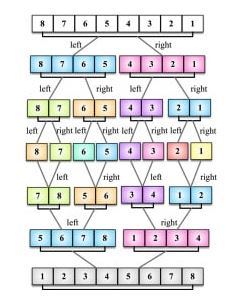

# Алгоритмы и структуры данных <a name='home'></a> 

+ [Время выполнения](#O-big)
### Поиск
+ [Бинарный поиск](#binary)
### Сортировка
+ [Пузырьковая сортировка](#bubble-sort)
+ [Шейкерная сортировка](#shaker-sort)
+ [Сортировка расческой](#comb-sort)
+ [Сортировка выбором](#selection-sort)
+ [Сортировка вставками](#insertion-sort)
+ [Быстрая сортировка](#quick-sort)
+ [Сортировка слиянием](#merge-sort)
+ [Пирамидальная сортировка](#heap-sort)

+ [Графы](#graph)
+ [Поиск в глубину](#dfs)
+ [Поиск в ширину](#bfs)

[^ Вверх](#home)
# Время выполнения <a name='O-big'></a>
О-большое описывает худший возможный млучай выполнения алгоритма.
  
Скорость алгоритма определяется темпом роста количества операций с увеличением данных.   
Формула описывает на сколько быстро возрастает врермя выполнения алгоритма с увеличение входных данных. 


[^ Вверх](#home)
# Бинарный поиск <a name='binary'></a>
**Время выполнения:** O(log n)  
Поиск выполняется на упорядоченном наборе данных. Определяется середина диапазона и сравнивается с искомым значением. 
Если искомое значение больше значения середины диапазона, то поиск производится в левой части диапазона, если меньше, 
то в правой части диапазона. Поиск происходит до тех пор, пока в поднаборе не останется ни одного элемента.

Пример, бинарный поиск для массивов JS:
```javascript
function findIndex(arr, elem) {
	return function isFind(arr, elem, start, end) {	
		if (start == end) return arr[end] == elem;
		var index = start + Math.floor((end - start)/2);
			
	 	if (arr[index] == elem) return true;
		if (arr[index] > elem) {
	       	return isFind(arr, elem, 0, index);
	    } else {
	        return isFind(arr, elem, index, end); 
	    }
	}(arr, elem, 0, arr.length);
} 

console.log('find ([1, 2, 3, 58] : ', findIndex([1, 2, 3, 58], 58));
console.log('find ([1, 2, 3, 58 , 66, 67, 72] : ', findIndex([1, 2, 3, 58 , 66, 67, 72], 58));
console.log('find ([1, 2, 3, 58 , 67, 72] : ', findIndex([1, 2, 3, 58 , 66, 67], 58));
console.log('find ([58 , 66, 67, 72] : ', findIndex([58 , 66, 67, 72], 58));
console.log('find ([58 , 66, 67, 72] : ', findIndex([59 , 66, 67, 72], 58));
```
Пример, бинарный поиск для строк (сначала упорядочивается строка) JS:   
```javascript
function findIndex(arr, elem) {
	return function isFind(arr, elem, start, end) {	
		if (start == end - 1) return arr[end] == elem;
		var index = start + Math.floor((end - start)/2);
			
		if (arr[index] == elem) return true;
		if (arr[index] > elem) {
			return isFind(arr, elem, 0, index);
		} else {
			return isFind(arr, elem, index, end); 
		}
	}(arr.split('').sort(), elem, 0, arr.length);
} 

console.log('asdabjkbjkkf : ', findIndex('asdabjkbjkkf', 'k')); //true
console.log('vxcvv : ', findIndex('vxcvv', 'x')); //true
console.log('rtyrygg : ', findIndex('rtyrygg', 'o')); //false
console.log('qweqewqeqw : ', findIndex('qweqewqeqw', 'q')); //true
console.log('xcvbnmmt : ', findIndex('xcvbnmmt', 't')); //true
```

[^ Вверх](#home)
# Пузырьковая сортировка <a name='bubble-sort'></a>
**Время выполнения (худшее):** O(n^2)    
**Время выполнения (лучшее):** O(n)   
Проход по массиву слева направо. Если текущий элемент больше следующего, то меняются элементы местами.

```javascript
const bubbleSort = ( arr ) => {
    let sorted = false;
    let count = 0;

    while (!sorted) {
        sorted = true;
        count++;

        for (let i = 0; i < arr.length; i++ ) {
            if ( arr[i] > arr[i + 1] ) {
                let temp = arr[i];
                arr[i] = arr[i + 1];
                arr[i + 1] = temp;
                sorted = false;
            }
        }

        console.log(JSON.stringify(arr));
    }

    console.log('Count of operations: ', count);
    return arr;
};

console.log(bubbleSort([7, 5, 9, 11, 3, 2, 8]));
// [5,7,9,3,2,8,11]
// [5,7,3,2,8,9,11]
// [5,3,2,7,8,9,11]
// [3,2,5,7,8,9,11]
// [2,3,5,7,8,9,11]
// [2,3,5,7,8,9,11]
// Count of operations: 6
// [2, 3, 5, 7, 8, 9, 11]
```

[^ Вверх](#home)
# Шейкерная сортировка <a name='shaker-sort'></a>
**Время выполнения (худшее):** O(n^2)   
**Время выполнения (среднее):** O(n^2)     
**Время выполнения (лучшее):** O(n)   
**Затраты по памяти:** O(1)   
Шейкерная сортировка отличается от пузырьковой тем, что она двунаправленная: алгоритм перемещается не строго слева направо, а сначала слева направо, затем справа налево.


[^ Вверх](#home)
# Сортировка расческой <a name='comb-sort'></a>
**Время выполнения (худшее):** O(n^2)   
**Время выполнения (лучшее):** O(n*log n)   
**Затраты по памяти:** O(1) 
Проход по массиву слева направо, сравнивая элементы  на расстоянии и по необходимости переставляя их.  
Оптимально изначально взять расстояние равным длине массива, а далее делить его на некоторый коэффициент, равный примерно 1.247. Когда расстояние станет равно единице, выполняется сортировка пузырьком. 


[^ Вверх](#home)
# Сортировка выбором <a name='selection-sort'></a>
**Время выполнения (худшее):** O(n^2)   
**Время выполнения (среднее):** O(n^2)     
**Время выполнения (лучшее):** O(n^2)   
**Затраты по памяти:** O(n)   
Перебор по массив, в ходе которого ищется минимальный элемент от текущей позиции до конца массива и если он меньше текущего элемента, то элементы меняются местами.
```javascript
var selectionSort = (arr) => {
    for ( var i = 0; i < arr.length; i++ ) {
        var index = arr.indexOf(Math.min(...arr.slice(i + 1 , arr.length)));

        if ( arr[index] < arr[i] ) {
            var temp = arr[i];
            arr[i] = arr[index];
            arr[index] = temp;
        }
    }

    return arr;
}

console.log(selectionSort([7, 5, 9, 11, 3, 2, 8]));
// [2, 3, 5, 7, 8, 9, 11]
```

[^ Вверх](#home)
# Сортировка вставками <a name='insertion-sort'></a>
**Время выполнения (худшее):** O(n^2)   
**Время выполнения (лучшее):** O(n)   
При сортировке вставками массив постепенно перебирается слева направо. При этом каждый последующий элемент размещается так, чтобы он оказался между ближайшими элементами с минимальным и максимальным значением.

Например, если элемент больше предыдущего, то поменять элементы местами и делать такие перестановки, пока левый элемент не будет меньше. 

```javascript
const insertionSort = ( arr ) => {
    for (let i = 0; i < arr.length; i++) {
        const current = arr[i];
        let j = i;

        while (j > 0 && arr[j - 1] > current) {
            arr[j] = arr[j - 1];
            j--;
        }

        arr[j] = current;
        console.log('current: ', current);
        console.log(JSON.stringify(arr));
    }

    return arr;
}

console.log(insertionSort([7, 5, 9, 11, 3, 2, 8]));
// current: 7
// [7,5,9,11,3,2,8]
// current: 5
// [5,7,9,11,3,2,8]
// current: 9
// [5,7,9,11,3,2,8]
// current: 11
// [5,7,9,11,3,2,8]
// current: 3
// [3,5,7,9,11,2,8]
// current: 2
// [2,3,5,7,9,11,8]
// current: 8
// [2,3,5,7,8,9,11]
// [2, 3, 5, 7, 8, 9, 11]
```

[^ Вверх](#home)
# Быстрая сортировка<a name='quick-sort'></a>
**Время выполнения (худшее):** O(n^2)   
**Время выполнения (среднее):** O(n*log n)     
**Время выполнения (лучшее):** O(n)   
**Затраты по памяти:** O(n)   
Выбирается опроный элемент, например, посреди массива. Затем все элементы, что меньше него перекидываются налево, а все, что больше направо. Далее этот же алгоритм применяется для всех его частей.
```javascript
var splitArray = (arr, left, right) => {
    var index = Math.floor((left + right)/2);
    var elem = arr[index];
    var i = left;
    var j = right;

    console.log('elem: ', elem);

    while ( i <= j ) {
        while ( arr[i] < elem ) {
            i++;
        }

        while ( arr[j] > elem ) {
            j--;
        }

        if ( i <= j ) {
            const temp = arr[i];
            arr[i] = arr[j];
            arr[j] = temp;
            i++;
            j--;
        }
    }

    console.log('arr: ', JSON.stringify(arr));
    return i;
}

var quickSort = (arr, left, right) => {
    if ( arr.length > 1 ) {
        var index = splitArray(arr, left, right);

          if (left < index - 1) {
            quickSort(arr, left, index - 1);
        }
        if (index < right) {
            quickSort(arr, index, right);
        }
    }

    return arr;
}

var testArr = [7, 5, 9, 11, 3, 2, 8, 12, 1, 15];
console.log(quickSort(testArr, 0, testArr.length - 1));

// elem:  3
// arr:  [1,2,3,11,9,5,8,12,7,15]
// elem:  2
// arr:  [1,2,3,11,9,5,8,12,7,15]
// elem:  1
// arr:  [1,2,3,11,9,5,8,12,7,15]
// elem:  8
// arr:  [1,2,3,7,8,5,9,12,11,15]
// elem:  8
// arr:  [1,2,3,7,5,8,9,12,11,15]
// elem:  7
// arr:  [1,2,3,5,7,8,9,12,11,15]
// elem:  12
// arr:  [1,2,3,5,7,8,9,11,12,15]
// elem:  9
// arr:  [1,2,3,5,7,8,9,11,12,15]
// elem:  12
// arr:  [1,2,3,5,7,8,9,11,12,15]
```

[^ Вверх](#home)
# Сортировка слиянием <a name='merge-sort'></a>
**Время выполнения (худшее):** O(n*log n)   
**Время выполнения (среднее):** O(n*log n)     
**Время выполнения (лучшее):** O(n*log n)   
**Затраты по памяти:** O(n)   
Массив рекурсивно разбивается пополам до массивов из одного элемента, а дальше из двух соседних массив сравниваются нулевые элементы и сливаются в один массив.  
  

```javascript
var merge = (left, right) => {
    var arr = [];

    while (left.length && right.length) {
        arr.push( left[0] < right[0] ? left.shift() : right.shift() );
    }

    return [...arr, ...left, ...right];
}

var mergeSort = (arr) => {
    if ( arr.length < 2 ) {
        return arr;
    }

    var half = Math.floor(arr.length / 2);
    var left = arr.splice(0, half);
    
    return merge(mergeSort(left), mergeSort(arr));
}

console.log(mergeSort([7, 5, 9, 11, 3, 2, 8]));
// [2, 3, 5, 7, 8, 9, 11]
```


[^ Вверх](#home)
# Пирамидальная сортировка <a name='heap-sort'></a>
**Время выполнения (худшее):** O(n*log n)   
**Время выполнения (среднее):** O(n*log n)     
**Время выполнения (лучшее):** O(n*log n)   
**Затраты по памяти:** O(n)   
При этой сортировке сначала строится пирамида из элементов исходного массива. Пирамида (или двоичная куча) — это способ представления элементов, при котором от каждого узла может отходить не больше двух ответвлений. А значение в родительском узле должно быть больше значений в его двух дочерних узлах.  
Пирамидальная сортировка похожа на сортировку выбором, где мы сначала ищем максимальный элемент, а затем помещаем его в конец. Дальше нужно рекурсивно повторять ту же операцию для оставшихся элементов.

[^ Вверх](#home)
# Графы <a name='graph'></a>
**Виды графов:**  
+ Взвешенные/Невзвешенные графы - графы у которые присутствуют/отсутствуют веса у граней; Графы с отрицательными весами;  
+ Направленные/Ненапрвленные графы - грани имет/не имеют направления, по сути ненаправленные грфы являются двунаправленными. 


[^ Вверх](#home)
# Поиск в глубину <a name='dfs'></a>
**Время выполнения:** O(V + E), где V - кол-во вершин, Е - кол-во граней.  
Проход по графу осуществляется по каждой ветке до конца, если результат не найден, то происходит возвращение к начальной точке и происходит движение по следующей ветке.
```javascript
1
| \
2 3
| \
4 5
Может возникнуть ситуация что у 1 родитель будет 4.

class Category {
private int id;
private Category parent;
}

//ГОТОВ - метод который получает детей первого уровня
//1 - 2, 3
//2 - 4
List<Category> getChilds(Category category) { … }


//РЕАЛИЗОВАТЬ - метод для получения всех детей
//1 - 2, 3, 4, 5 порядок не важен
List<Category> getAllChilds(Category category) {
//ToDo
const children = [];
    return (function getChildren(cat) {
        const newChildren = this.getChilds(cat);

        if ( newChildren ) {
            for (let i = 0; i < newChildren.length; i++){
                const child = newChildren[i];

            if ( children.includes(child) ) {
                return children;
            } else {
                children.push(child);
                return getChildren(child);
            }
        }

        return children;
    })(category);
}
```


[^ Вверх](#home)
# Поиск в ширину <a name='bfs'></a>
**Время выполнения:** O(V + E), где V - кол-во вершин, Е - кол-во граней.  
Используется для нахождения кратчайшего пути по кол-ву граней. Проход по графу сначала осуществляется по ближайшим соседям, т.е. по ближайшему уровню, затем спускается на следующий уровень.